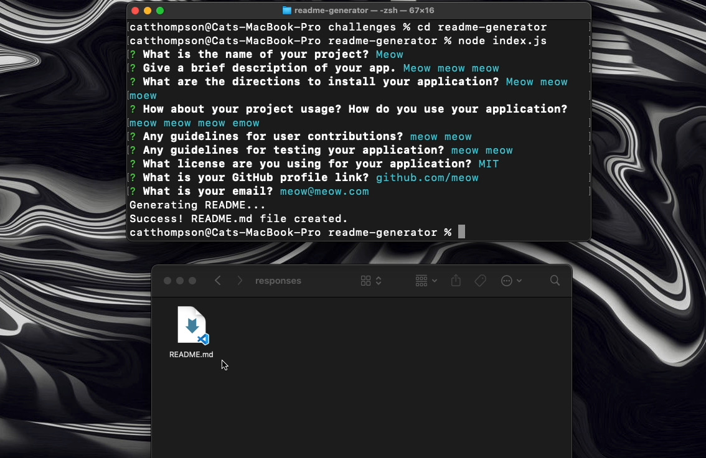

# readme-generator
09 Node.js Challenge: Professional README Generator

---

## User Story (from challenge)

```md
AS A developer
I WANT a README generator
SO THAT I can quickly create a professional README for a new project
```

## Acceptance Criteria (from challenge)

```md
GIVEN a command-line application that accepts user input
WHEN I am prompted for information about my application repository
THEN a high-quality, professional README.md is generated with the title of my project and sections entitled Description, Table of Contents, Installation, Usage, License, Contributing, Tests, and Questions
WHEN I enter my project title
THEN this is displayed as the title of the README
WHEN I enter a description, installation instructions, usage information, contribution guidelines, and test instructions
THEN this information is added to the sections of the README entitled Description, Installation, Usage, Contributing, and Tests
WHEN I choose a license for my application from a list of options
THEN a badge for that license is added near the top of the README and a notice is added to the section of the README entitled License that explains which license the application is covered under
WHEN I enter my GitHub username
THEN this is added to the section of the README entitled Questions, with a link to my GitHub profile
WHEN I enter my email address
THEN this is added to the section of the README entitled Questions, with instructions on how to reach me with additional questions
WHEN I click on the links in the Table of Contents
THEN I am taken to the corresponding section of the README
```

## Features

- **Automated README Creation:** Creates a README.md with essential sections.
- **Customizable Input:** Takes user input for project details.
- **License Badge:** Includes a license badge in the README.
- **GitHub Info:** Adds GitHub profile and contact links.

## Additional Resources


- **Video Demo:** [CLICK HERE](https://youtu.be/naWCc0PbGSo)


## Usage

Before you begin, ensure you have [Node.js](https://nodejs.org/) installed on your computer. Then, follow these steps:

1. **Clone the Repository**: Clone this repository to your local machine using `git clone <https://github.com/catxcoding/readme-generator.git>`.
2. **Install Dependencies**: Navigate to the cloned directory in your terminal and run `npm install`. This will install all necessary dependencies, including the Inquirer package.

## Running the Application

To start the application, open your terminal, navigate to the project directory, and run the following command:`node index.js`

## Providing Input

After running the command, the application will prompt you for various details about your project:

- **Project Name**: Enter the name of your project.
- **Project Description**: Provide a brief description of what your project does.
- **Installation Instructions**: Detail the steps required to install your project.
- **Usage Information**: Explain how to use your project. Include examples if possible.
- **Contribution Guidelines**: Describe how others can contribute to your project.
- **Test Instructions**: Provide instructions on how to run tests for your project.
- **License**: Choose a license for your project from the provided list.
- **GitHub Profile**: Enter your GitHub profile URL.
- **Email Address**: Provide your email for contact purposes.

## Generating the README

Once you've answered all the prompts:

- The application will generate a `README.md` file in the `./responses` directory.

## Accessing Your README

Navigate to the `./responses` directory in your project folder to find the generated README file. You can then review, edit further if needed, and use it for your project.

## Additional Resources
**ChatGBT**: For aspects of README

**MDN Web Docs**: [MDN Web Docs](https://developer.mozilla.org/)

**W3Schools**: [W3Schools](https://www.w3schools.com/)

**Node.js Documentation**: [Node.js Docs](https://nodejs.org/en/docs/)

**npm Documentation**: [npm Docs](https://docs.npmjs.com/)

**Inquirer.js GitHub Repository**: [Inquirer.js on GitHub](https://github.com/SBoudrias/Inquirer.js)


